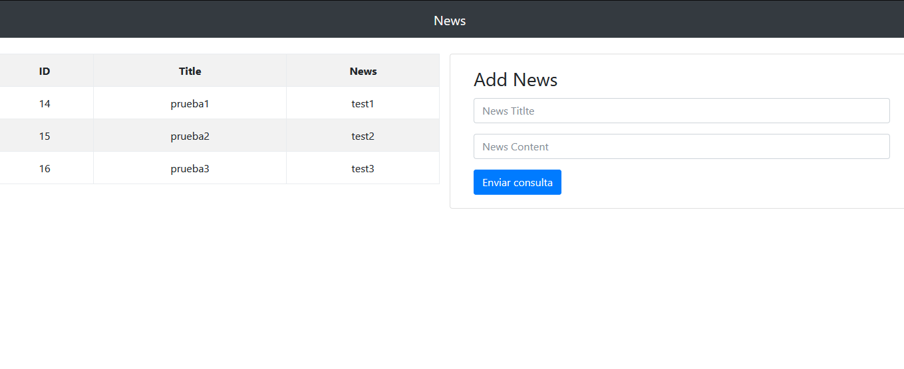

# JavaScript Express MySQL

Este repositorio contiene el código de un proyecto que agrega registros a una tabla en MySQL usando Express.

Comandos para ejecutar la aplicación web:

1. Recuperar la carpeta de node_modules: `npm i`
2. Iniciar la aplicación: `npm start`